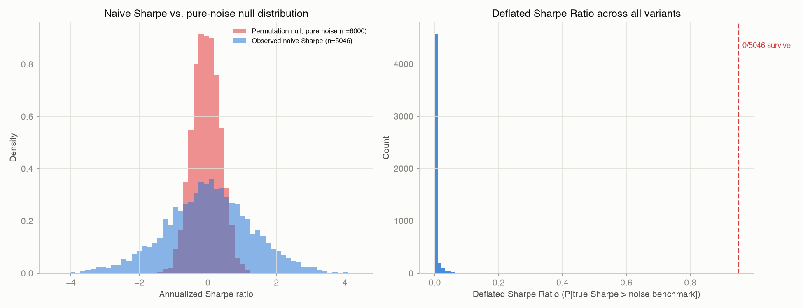
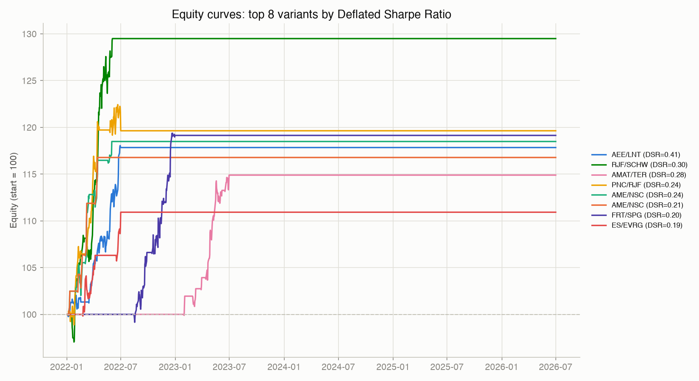

# statarb backtest report

Generated by `main.py`. This report exists to answer one question: after
testing 5,112 strategy variants, how many of them represent real edge
versus how many just got lucky?

## Universe

- 486 tickers, 11 GICS sectors
- 2020-01-02 to 2026-07-17 (1643 trading days)
- See the README for survivorship-bias and data-quality caveats that apply to every number below.

## Walk-forward folds

2-year rolling train window, 6-month test window, 6-month step. Pairs are
screened for Engle-Granger cointegration (p<0.05) and hedge ratios fixed
*only* on each fold's training window; the test window is never used for
either.

| Train window | Test window | Pairs selected | Test days |
|---|---|---|---|
| 2020-01-02 to 2022-01-02 | 2022-01-02 to 2022-07-02 | 100 | 125 |
| 2020-07-02 to 2022-07-02 | 2022-07-02 to 2023-01-02 | 22 | 126 |
| 2021-01-02 to 2023-01-02 | 2023-01-02 to 2023-07-02 | 31 | 124 |
| 2021-07-02 to 2023-07-02 | 2023-07-02 to 2024-01-02 | 28 | 126 |
| 2022-01-02 to 2024-01-02 | 2024-01-02 to 2024-07-02 | 31 | 125 |
| 2022-07-02 to 2024-07-02 | 2024-07-02 to 2025-01-02 | 19 | 127 |
| 2023-01-02 to 2025-01-02 | 2025-01-02 to 2025-07-02 | 11 | 123 |
| 2023-07-02 to 2025-07-02 | 2025-07-02 to 2026-01-02 | 24 | 127 |
| 2024-01-02 to 2026-01-02 | 2026-01-02 to 2026-07-02 | 14 | 124 |

Note how much the pair count varies fold to fold (11-100):
cointegration relationships are not regime-stable, and a strategy that
looks great in one window can lose its entire tradable universe in the next.

## Signal vs. noise: the core result

**1,051 of 5,112 variants (20.6%) look profitable naively**
(annualized Sharpe > 1.0).
**0 survive** after correcting for the fact that 5,112 variants
were tried (Deflated Sharpe Ratio > 0.95).

Left panel: the observed naive Sharpe distribution against a permutation-test
null built by reshuffling each pair's own daily returns (destroying any real
lead/lag relationship while preserving each leg's volatility) and rerunning
the identical signal logic on the shuffled path -- this is what pure noise
looks like on this exact universe with these exact rules. Right panel: the
Deflated Sharpe Ratio for every variant, which folds in *how many* variants
were tried; almost the entire mass sits near zero.

A subtlety worth stating plainly: a pair-specific permutation test on the
single best variant can still reject the null in isolation (that one pair's
co-movement isn't obviously random). The DSR is more skeptical because it
also accounts for the fact that this "best" variant was cherry-picked out of
5,112 attempts. Both tests are valid; they answer different questions,
and the gap between their answers *is* the multiple-testing problem this
project is built to demonstrate.

## Equity curves

Top variants by Deflated Sharpe Ratio -- shown for illustration of what the
"best" results look like, not as a claim that they clear the survival bar
above (most don't).

## Top 20 variants by naive Sharpe

| # | ticker_a | ticker_b | sector | lookback | entry | exit | sharpe | deflated_sharpe | max_drawdown | hit_rate | n_trading_days | total_return |
| --- | --- | --- | --- | --- | --- | --- | --- | --- | --- | --- | --- | --- |
| 1 | AEE | LNT | Utilities | 60 | 1.5 | 0.0 | 4.38 | 0.414 | -1.6% | 57.5% | 106.0 | 17.8% |
| 2 | RJF | SCHW | Financials | 20 | 1.5 | 0.0 | 4.08 | 0.302 | -3.1% | 60.2% | 93.0 | 29.5% |
| 3 | AME | NSC | Industrials | 40 | 2.0 | 0.5 | 4.00 | 0.208 | -1.4% | 65.2% | 23.0 | 16.8% |
| 4 | AMAT | TER | Information Technology | 20 | 1.5 | 0.5 | 3.99 | 0.284 | -2.1% | 61.9% | 63.0 | 14.9% |
| 5 | AME | NSC | Industrials | 40 | 1.5 | 0.5 | 3.85 | 0.237 | -3.1% | 63.0% | 46.0 | 18.5% |
| 6 | PNC | RJF | Financials | 20 | 2.0 | 0.0 | 3.71 | 0.244 | -2.3% | 55.7% | 88.0 | 19.6% |
| 7 | ES | EVRG | Utilities | 90 | 2.0 | 0.0 | 3.65 | 0.193 | -2.4% | 59.5% | 42.0 | 10.9% |
| 8 | FRT | SPG | Real Estate | 40 | 2.0 | 0.0 | 3.65 | 0.204 | -1.9% | 58.8% | 85.0 | 19.1% |
| 9 | BAC | FITB | Financials | 40 | 2.0 | 0.5 | 3.55 | 0.180 | -2.1% | 57.5% | 80.0 | 18.7% |
| 10 | FITB | TFC | Financials | 60 | 2.5 | 0.5 | 3.51 | 0.154 | -1.2% | 61.8% | 34.0 | 6.5% |
| 11 | ADI | MPWR | Information Technology | 40 | 2.5 | 0.5 | 3.44 | 0.167 | -1.5% | 55.6% | 45.0 | 10.2% |
| 12 | NTRS | USB | Financials | 60 | 2.5 | 0.5 | 3.41 | 0.102 | -1.3% | 63.6% | 33.0 | 10.4% |
| 13 | GL | HBAN | Financials | 20 | 2.5 | 0.0 | 3.38 | 0.141 | -1.8% | 64.4% | 45.0 | 11.7% |
| 14 | AEE | LNT | Utilities | 20 | 1.5 | 0.0 | 3.37 | 0.171 | -3.3% | 54.2% | 107.0 | 13.0% |
| 15 | AEE | LNT | Utilities | 20 | 2.0 | 0.0 | 3.37 | 0.172 | -1.8% | 57.6% | 66.0 | 11.0% |
| 16 | NTRS | RJF | Financials | 60 | 2.5 | 0.5 | 3.37 | 0.127 | -2.8% | 55.8% | 43.0 | 14.6% |
| 17 | AEE | ES | Utilities | 40 | 2.0 | 0.5 | 3.36 | 0.114 | -1.0% | 51.4% | 35.0 | 10.7% |
| 18 | AEP | EVRG | Utilities | 60 | 1.5 | 0.0 | 3.32 | 0.174 | -4.0% | 62.5% | 96.0 | 22.4% |
| 19 | AXP | USB | Financials | 20 | 2.0 | 0.0 | 3.31 | 0.150 | -3.4% | 54.8% | 104.0 | 25.3% |
| 20 | RJF | SCHW | Financials | 20 | 2.0 | 0.0 | 3.30 | 0.110 | -3.3% | 56.3% | 87.0 | 22.5% |

`deflated_sharpe` is the number that matters: compare it to the naive
`sharpe` column and note how little of the naive ranking survives.
